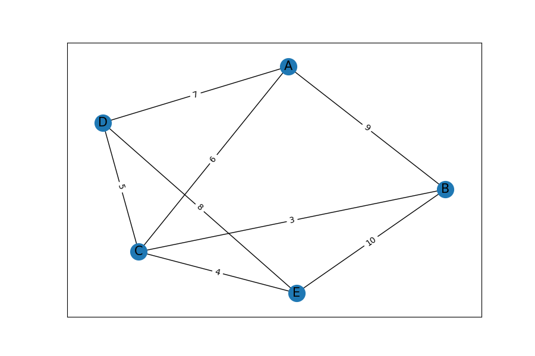
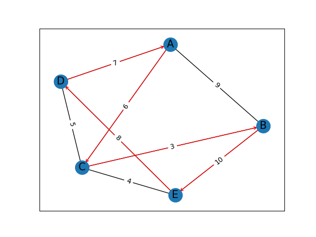

# Hybrid Genetic Algorithm

## Travelling Sales-Man Problem:
    
        Given a set of Cities and Distance between every pair of cities, the problem is to find
        the shortest possible route that visits every city exactly once and return to the starting Point.
        The Below Diagram iis what that is used as the Map for the cities.
        

## Genetic Algorithm:
        It is a Heuristic Search Algorithm that uses the idea of Evolution to Find the Best result. It is based on Natural 
        Selection and Mutations.They are used to generate High Quality Solutions for optimization problems and searches
        It basically works based on the idea of "Survival of the Fittest"
        
        Pseudo Code:
                1) Randomly Intialize a population( In this Case write all the paths that are possible)
                2) Determine the Fitness of each solution in the Population(The cost of the Path)
                3) Until X iterations:
                    a) Perform Tournament Selection and select 2 parents
                    b) Cross-over and Generate 2 New Off-Springs.
                    c) Perform Mutation on them
                    d) Calculate the fitness insert in place of the least fitness

## Simulated Annealing:

        Genetic Algorithm usually gets stuck @ Local Minima in these cases, so as to account
        for Global minima weuse this Technique called Simulated Annealing. This Technique 
        uses an Analogy similar to the Metallurgical practice by which a metal is heated 
        to a very high temperature and then drastically cooled down. This idea can be used 
        for minimizing any function where-in random changes are done during the time 
        Temperature Falls from 1 to a minimum of 10^-4

## Hybrid Genetic Algorithm:

        This Algorithm is nothing but Genetic Algorithm Coupled with Some other Algorithms like 
        Hill-climbing etc., so as to account for Global Minima. Here we have used the 
        Simulated Annealing technique for the Purpose
        Pseudo Code for This Algorithm:

                1) Randomly Intialize a population( In this Case write all the paths that are possible)
                2) Determine the Fitness of each solution in the Population(The cost of the Path)
                3) Until X iterations:
                    a) Perform Tournament Selection and select 2 parents
                    b) Cross-over and Generate 2 New Off-Springs.
                    c) Perform Mutation on them
                    d) Calculate the fitness insert in place of the least fitness
                    e) Temp is set to 1000
                    f) End_Temp is set to 0.99
                    g) Util Temp < End_Temp    
                            A) Mutate both the offsprings
                            B) Check if the Score has Improved and also account the 
                                randomness for acceptence
                                    i) if passed change the intial Offsprings
                                    ii) pass
                            C)reduce the Temperature
        
        Final Result that was recorded is :
            Best Path: possible paths    E-D-A-C-B-E
            Cost                       34
            The below Image shows the Final Path
            
